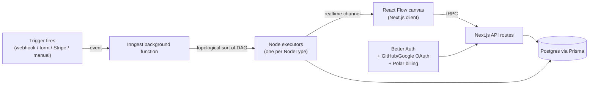
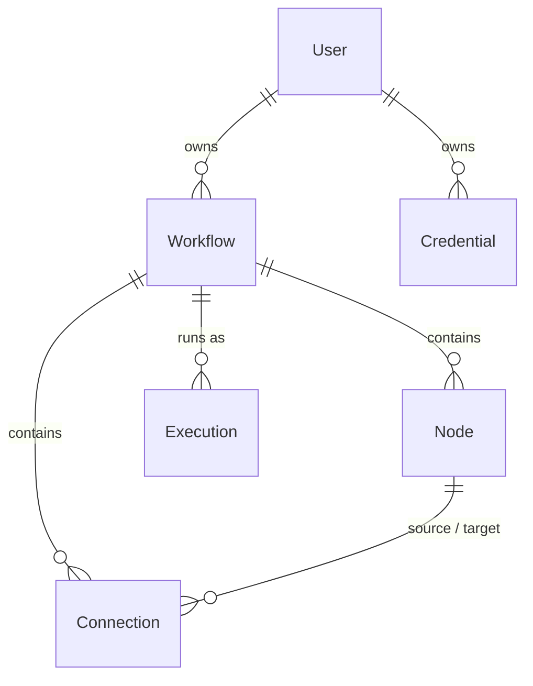

# Nodex


[](https://nodex-peach.vercel.app/login)

A self-hosted workflow automation platform, in the shape of n8n or Zapier: a visual, drag-and-drop canvas for chaining triggers, AI models and messaging integrations into automations that run in the background and report their status back live.

> [!NOTE]
> Built by following Code with Antonio's ["Build and Deploy an N8N & Zapier Clone"](https://www.youtube.com/watch?v=ED2H_y6dmC8) course (Nodebase), parts 1 and 2, over May–September 2026 — 34 commits tracking the course chapter by chapter, from initial setup through auth, the execution engine, every integration, and production deployment. Both parts are complete.

## What you can build with it

A workflow is a directed graph of nodes. A few examples of what the shipped node types let you wire together:

- **Google Form submission → OpenAI → Discord** — a form response triggers the workflow, an OpenAI node classifies or summarizes the answer, a Discord node posts the result to a channel.
- **Stripe event → Anthropic → Slack** — a payment webhook fires, an Anthropic node drafts a personalized message from the order data, a Slack node sends it.
- **Manual trigger → HTTP request → Gemini** — run a workflow on demand, call an external API, feed the response into Gemini for analysis.

Any trigger (manual, webhook, Google Form, Stripe) can feed into any chain of AI (OpenAI, Anthropic, Gemini), messaging (Discord, Slack) or HTTP request nodes — the execution engine doesn't hardcode which node types can follow which.

## Architecture



A trigger event starts an Inngest function, which loads the workflow's nodes and connections, topologically sorts them into execution order, and runs each node through a per-type executor — publishing status back to the editor over a realtime channel as it goes, so a running workflow updates live instead of requiring a page refresh.

## Data model



`Credential` stores a user's own API keys and tokens (OpenAI, Anthropic, Discord, Slack, ...) encrypted at rest — see [Key decisions](#key-decisions).

## Key decisions

- **Workflows execute in topological order, computed at run time** ([src/inngest/utils.ts](src/inngest/utils.ts), [src/inngest/functions.ts](src/inngest/functions.ts)) — a workflow's nodes and connections are loaded as a graph and sorted with `toposort` before execution, rather than relying on the order nodes were created in. This is what makes branching/merging workflows in the editor actually execute correctly.
- **One executor per node type, dispatched through a registry** ([src/features/executions/lib/executor-registry.ts](src/features/executions/lib/executor-registry.ts)) — `Record<NodeType, NodeExecutor>` maps every `NodeType` to its executor, with a runtime check that throws on an unregistered type. Adding a new integration means adding one entry, not touching the execution engine.
- **Inngest for durable background execution, not a custom queue** — triggers publish an event; Inngest handles retries (3 in production, 0 in dev), step-by-step execution, and realtime pub/sub channels per node type, so the editor can show live per-node status while a workflow runs, without a hand-rolled job runner or websocket layer.
- **User-supplied credentials, encrypted, not platform-wide API keys** ([src/lib/encryption.ts](src/lib/encryption.ts), `Credential` model) — OpenAI/Anthropic/Discord/Slack access is BYOK: each user stores their own keys, encrypted with a server-side `ENCRYPTION_KEY` before hitting the database, rather than the platform holding one shared key and eating the API cost for every user.
- **Better Auth's Polar plugin for auth and billing in one system** ([src/lib/auth.ts](src/lib/auth.ts)) — sign-in (email/password, GitHub, Google), customer creation and checkout/subscription state all go through Better Auth's `polar()` plugin, instead of wiring Stripe billing logic by hand alongside a separate auth system.
- **tRPC end to end** ([src/trpc/](src/trpc)) — workflows, credentials and executions are all exposed through typed tRPC routers consumed via TanStack Query on the client, so a change to a router's input/output shape is a compile error in the UI, not a runtime surprise.

## Stack

| Layer | Technology | Role in this project |
|---|---|---|
| Framework | Next.js 15 (App Router), React 19 | Client app + API routes |
| Canvas | React Flow (`@xyflow/react`) | Drag-and-drop workflow editor |
| API | tRPC, TanStack Query | Typed client-server calls, caching |
| Database | Prisma 7, PostgreSQL (Neon) | Users, workflows, nodes, connections, executions, credentials |
| Auth | Better Auth, GitHub/Google OAuth | Sign-in, session management |
| Billing | Polar (via Better Auth plugin) | Checkout, subscriptions, customer portal |
| Background jobs | Inngest | Durable workflow execution, retries, realtime channels |
| AI providers | AI SDK (`@ai-sdk/*`) — OpenAI, Anthropic, Gemini | AI node executors |
| Messaging | Discord, Slack | Messaging node executors |
| Monitoring | Sentry | Error tracking + AI-assisted monitoring |
| State (client) | Jotai | Editor UI state |
| UI | Tailwind CSS, Radix / shadcn | Component library |

## How it works, end to end

1. **Sign up** (email/password, GitHub or Google) — a Polar customer is created automatically.
2. **Add credentials** — store your own OpenAI/Anthropic/Discord/Slack keys under Credentials; they're encrypted before they're saved.
3. **Build a workflow** — drop a trigger node on the canvas, connect it to any chain of AI, messaging or HTTP request nodes.
4. **Trigger it** — manually, or by firing the workflow's webhook / Google Form / Stripe event.
5. **Watch it run** — each node's status updates live on the canvas as Inngest works through the sorted graph.
6. **Check the history** — every run is recorded as an `Execution`, inspectable per node afterward.

## What this taught me

- How to actually implement a DAG-based execution engine: loading a graph, topologically sorting it, and running it node by node — not just calling it a "workflow engine" without the sorting step.
- Durable background jobs with Inngest instead of `setTimeout`/cron-style hacks: retries, step functions, and realtime pub/sub for live status came from the library, not from code I'd have gotten right myself on the first try.
- Wiring multiple AI provider SDKs (OpenAI, Anthropic, Gemini) behind one executor interface so the rest of the app doesn't care which provider a given AI node uses.
- Encrypting user-supplied secrets (API keys, tokens) at rest, and the BYOK trade-off it implies for a SaaS product (users configure their own provider costs).
- Using an auth library's plugin system (Better Auth + Polar) to get subscriptions and a customer portal without hand-building billing state management.
- End-to-end type safety with tRPC across a genuinely large surface (workflows, credentials, executions) rather than a toy CRUD example.

## Run locally

Requires a PostgreSQL database (e.g. a free Neon project), and your own API keys/OAuth apps for the services you want to exercise.

```bash
npm install
npx prisma generate
npx prisma migrate dev
npm run dev          # http://localhost:3000

# in a second terminal, for background job execution
npm run inngest
```

<details>
<summary>Environment variables</summary>

| Key | Purpose |
|---|---|
| `DATABASE_URL` | Postgres connection string |
| `BETTER_AUTH_SECRET` | Session signing secret |
| `NEXT_PUBLIC_APP_URL` | Base URL used by auth callbacks |
| `GITHUB_CLIENT_ID` / `GITHUB_CLIENT_SECRET` | GitHub OAuth app |
| `GOOGLE_CLIENT_ID` / `GOOGLE_CLIENT_SECRET` | Google OAuth app |
| `POLAR_ACCESS_TOKEN` | Polar billing integration |
| `POLAR_SUCCESS_URL` | Redirect after checkout |
| `ENCRYPTION_KEY` | Encrypts stored user credentials |
| `SENTRY_DSN` | Error tracking (conventional Sentry env var, read by `@sentry/nextjs`) |

OpenAI, Anthropic, Gemini, Discord and Slack access is **not** configured via environment variables — each user adds their own credentials in-app (see [How it works](#how-it-works-end-to-end)). No `.env.example` is committed — TODO for me to add one.

</details>

## Project structure

```
.
├── src/app/                  # Routes: (auth), (dashboard)/(editor), (dashboard)/(rest), api/{trpc,inngest,webhooks,auth}
├── src/features/
│   ├── workflows/             # Workflow CRUD, list/search
│   ├── editor/                # React Flow canvas, node selector, editor state
│   ├── triggers/               # Manual, Google Form, Stripe trigger nodes
│   ├── executions/             # AI/messaging/HTTP node executors + execution history
│   ├── credentials/            # Encrypted user credentials
│   └── subscriptions/          # Polar subscription state
├── src/inngest/                # Background execution: functions, per-node realtime channels
├── src/trpc/                   # tRPC routers and client setup
├── src/lib/                    # auth, db, encryption, polar client
└── prisma/                     # Schema: User, Workflow, Node, Connection, Execution, Credential
```

## Tests and status

There are no automated tests. The app is live and functional at the link above; both parts of the course are implemented, including production deployment (a Vercel-bot PR fixing a React Server Components CVE has already been merged).

## License

No license file is included. Built as a personal learning project — shown here for portfolio purposes.
